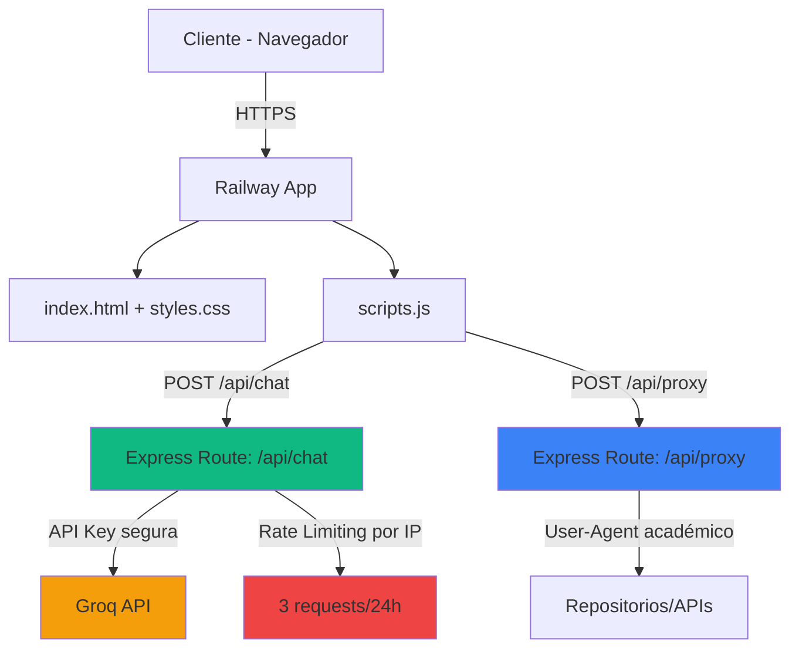

# Neotesis Perú 🎓

Plataforma académica integral con generador de citas APA, chat PDF con IA y calculadoras estadísticas para estudiantes universitarios peruanos.


## 🌟 Características

- **Generador APA 7ma Edición**: Crea referencias bibliográficas precisas para libros, artículos y páginas web
- **Auto-Cita Inteligente**: Genera citas automáticamente desde URLs o DOIs
  - Soporte para repositorios peruanos (UCV, UPAO, UNMSM, etc.)
  - Compatible con bases de datos científicas (ScienceDirect, CrossRef, etc.)
  - Detección automática de metadatos
- **Cita en Lote**: Procesa hasta 20 URLs simultáneamente
- **Calculadora de Muestra**: Determina el tamaño de muestra para investigaciones cuantitativas
- **Chat PDF con IA**: Analiza documentos PDF usando Llama 3.3 de Groq
  - Hasta 12,000 caracteres de contexto
  - 3 consultas gratuitas por día

## 🏗️ Arquitectura



### Seguridad

✅ **API Keys protegidas**: Nunca expuestas en el cliente, solo en variables de entorno del servidor  
✅ **Rate Limiting robusto**: Implementado por IP en el servidor (no manipulable desde el cliente)  
✅ **Whitelist de dominios**: Solo se permite scraping de sitios académicos autorizados  
✅ **Validación de inputs**: Todas las entradas del usuario son validadas y sanitizadas  
✅ **Headers de seguridad**: CSP, X-Frame-Options, etc.

## 🚀 Deployment en Railway

### Paso 1: Obtener una Groq API Key

1. Ve a [console.groq.com](https://console.groq.com/)
2. Crea una cuenta o inicia sesión
3. Ve a **API Keys** en el menú lateral
4. Haz clic en **Create API Key**
5. Copia la key (formato: `gsk_...`)

> [!IMPORTANT]
> Guarda tu API key en un lugar seguro. No la compartas ni la subas a GitHub.

### Paso 2: Preparar el Repositorio

```bash
# Clonar el repositorio (si aún no lo has hecho)
git clone https://github.com/TU_USUARIO/neotesis.git
cd neotesis

# Instalar dependencias
npm install
```

### Paso 3: Deploy en Railway

1. **Sube tu código a GitHub**:
   ```bash
   git add .
   git commit -m "Migración a Railway con Express"
   git push origin main
   ```

2. **Conecta con Railway**:
   - Ve a [railway.app](https://railway.app/)
   - Crea una cuenta o inicia sesión
   - Haz clic en **New Project** → **Deploy from GitHub repo**
   - Autoriza Railway para acceder a GitHub
   - Selecciona tu repositorio `neotesis`

3. **Railway detectará automáticamente**:
   - El proyecto Node.js
   - El comando `npm start`
   - Puerto automático (process.env.PORT)

4. **Agregar variable de entorno**:
   - En el dashboard de Railway, ve a tu proyecto
   - Ve a **Variables** en el menú lateral
   - Haz clic en **Add Variable**
   - **Key**: `GROQ_API_KEY`
   - **Value**: Tu API key de Groq (ej: `gsk_...`)
   - Haz clic en **Add**

5. **Deploy automático**:
   - Railway comenzará el build automáticamente
   - Espera a que complete (~2-3 minutos)
   - ¡Tu sitio estará live en la URL generada por Railway!

### Paso 4: Verificar el Deployment

1. **Verificar que la app está corriendo**:
   - En Railway Dashboard → **Deployments**
   - Deberías ver el deployment exitoso

2. **Probar el sitio**:
   - Abre la URL de Railway en el navegador
   - Ve a **Chat con PDF**
   - Sube un PDF de prueba
   - Haz una pregunta
   - Verifica que la IA responde correctamente

3. **Verificar rate limiting**:
   - Haz 3 consultas seguidas
   - En la 4ta consulta, deberías ver el mensaje de límite alcanzado
   - Verifica que aparece el countdown timer

## 💻 Desarrollo Local

### Requisitos

- Node.js 18 o superior
- npm o yarn

### Setup

```bash
# Instalar dependencias
npm install

# Crear archivo .env en la raíz del proyecto
echo "GROQ_API_KEY=tu_key_aqui" > .env

# Iniciar servidor de desarrollo
npm start
```

El sitio estará disponible en `http://localhost:3000`

### Estructura del Proyecto

```
neotesis/
├── server.js                # Servidor Express con rutas API
├── index.html               # Página principal
├── styles.css               # Estilos
├── scripts.js               # Lógica del cliente (SIN API keys)
├── hero.png                 # Imagen hero
├── package.json             # Dependencias
├── .gitignore               # Archivos ignorados por Git
└── README.md                # Este archivo
```

## 🔧 Troubleshooting

### Error: "GROQ_API_KEY no está configurada"

**Causa**: La variable de entorno no está configurada en Railway.

**Solución**:
1. Ve a Railway Dashboard → Tu proyecto → Variables
2. Agrega `GROQ_API_KEY` con tu key de Groq
3. Railway redeployará automáticamente

### Error: "Dominio no permitido"

**Causa**: Intentaste hacer scraping de un sitio que no está en la whitelist.

**Solución**: Solo se permiten repositorios académicos y bases de datos científicas. Verifica que la URL sea de un sitio permitido:
- Repositorios peruanos: UCV, UPAO, UTP, USIL, UPC, UNMSM
- APIs públicas: CrossRef, DOI.org
- Bases de datos: ScienceDirect, PubMed, arXiv, etc.

Para agregar un dominio a la whitelist, edita `netlify/functions/proxy.js` y agrega el dominio al array `ALLOWED_DOMAINS`.

### Error: "Has excedido el límite de consultas"

**Causa**: Has usado tus 3 consultas diarias del chat PDF.

**Solución**: El límite se resetea automáticamente después de 24 horas desde tu primera consulta. El countdown timer te muestra cuánto tiempo falta.

> [!NOTE]
> El rate limiting es por IP, no por navegador. Limpiar cookies o localStorage no te dará consultas adicionales.

### Las funciones no se despliegan

**Causa**: Netlify no detectó la carpeta `netlify/functions`.

**Solución**:
1. Verifica que `netlify.toml` tenga `functions = "netlify/functions"`
2. Verifica que los archivos `chat.js` y `proxy.js` existan en esa carpeta
3. Redeploy el sitio

### Error 500 en las funciones

**Causa**: Error interno en la función serverless.

**Solución**:
1. Ve a Netlify Dashboard → Functions → Selecciona la función → Logs
2. Revisa los logs para ver el error específico
3. Verifica que `GROQ_API_KEY` esté configurada correctamente
4. Verifica que `node-fetch` esté en `package.json`

## 📊 Rate Limiting

El sistema implementa rate limiting en dos capas:

### Capa 1: Cliente (localStorage)
- **Propósito**: Mejorar UX mostrando contador al usuario
- **Límite**: 3 consultas / 24 horas
- **Almacenamiento**: localStorage del navegador
- **Nota**: Fácilmente manipulable, solo para UX

### Capa 2: Servidor (IP-based)
- **Propósito**: Seguridad real
- **Límite**: 3 consultas / 24 horas por IP
- **Almacenamiento**: Memoria de la función serverless
- **Nota**: No manipulable desde el cliente

> [!WARNING]
> **Limitación conocida**: El rate limiting del servidor usa memoria de la función, que se resetea cuando la función se "enfría" (~15 minutos de inactividad).
> 
> Para un rate limiting más robusto en producción, considera usar:
> - Netlify Blobs (KV store)
> - Upstash Redis
> - Netlify Edge Functions con Deno KV

## 🔐 Seguridad

### Buenas Prácticas Implementadas

✅ **Nunca expongas API keys en el cliente**
- Las keys solo existen en variables de entorno del servidor
- El código del cliente nunca ve las keys

✅ **Valida todas las entradas**
- Todas las funciones serverless validan inputs
- Se sanitizan URLs para prevenir ataques

✅ **Usa whitelist de dominios**
- Solo se permite scraping de sitios académicos autorizados
- Previene uso malicioso del proxy

✅ **Implementa rate limiting**
- Previene abuso del servicio
- Protege tu cuota de Groq API

✅ **Maneja errores gracefully**
- No expongas detalles internos en mensajes de error
- Logs detallados solo en el servidor

## 📝 Licencia

MIT License - Neotesis Perú © 2025

## 🤝 Contribuciones

Las contribuciones son bienvenidas. Por favor:

1. Fork el repositorio
2. Crea una rama para tu feature (`git checkout -b feature/AmazingFeature`)
3. Commit tus cambios (`git commit -m 'Add some AmazingFeature'`)
4. Push a la rama (`git push origin feature/AmazingFeature`)
5. Abre un Pull Request

## 📧 Soporte

¿Necesitas ayuda? Contáctanos:

- WhatsApp: +51 900 000 000
- Email: soporte@neotesis.pe
- Web: https://neotesis.netlify.app

---

**Hecho con ❤️ para estudiantes universitarios peruanos**
