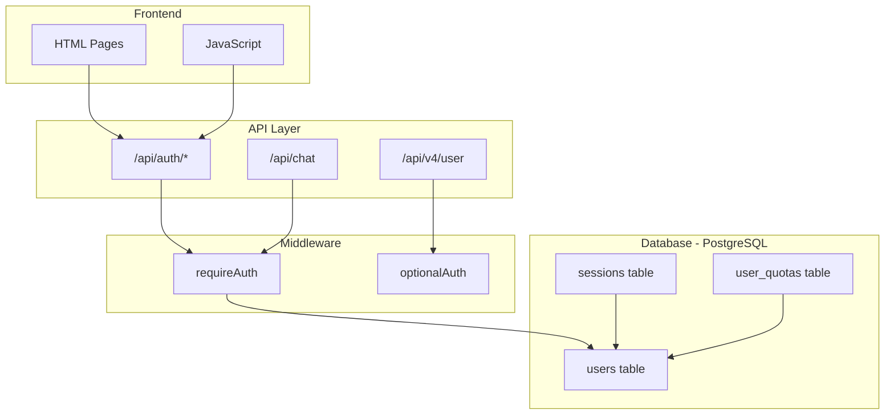

# Neotesis Perú - Authentication System Implementation Plan

## Overview
Implement a complete JWT-based authentication system for the Neotesis Peru application using the existing Sequelize infrastructure.

## Architecture



## Todo List

### Phase 1: Middleware Enhancement
- [ ] 1.1 Enhance [`middleware/auth.js`](middleware/auth.js) with:
  - `generateToken(userId, email)` function
  - `verifyToken(token)` function
  - `requireAuth` middleware (protects routes)
  - `optionalAuth` middleware (allows optional auth)
  - Database user verification

### Phase 2: Authentication Routes
- [ ] 2.1 Create [`routes/auth.js`](routes/auth.js) with:
  - `POST /api/auth/register` - User registration with validation
  - `POST /api/auth/login` - User login with password verification
  - `GET /api/auth/me` - Get current user info with quota data

### Phase 3: Database Models
- [ ] 3.1 Update [`models/User.js`](models/User.js) to add:
  - `name` field
  - `email_verified` field
  - `role` field with default 'user'
- [ ] 3.2 Create [`models/Session.js`](models/Session.js) for session tracking
- [ ] 3.3 Create [`models/UserQuota.js`](models/UserQuota.js) for usage tracking

### Phase 4: Server Integration
- [ ] 4.1 Update [`server.js`](server.js) to:
  - Import enhanced auth middleware
  - Add auth routes at `/api/auth`
  - Add `/api/v4/user` endpoint with optional auth
  - Protect `/api/chat` endpoint with `requireAuth`

### Phase 5: Documentation
- [ ] 5.1 Create [`docs/AUTH_API.md`](docs/AUTH_API.md) with API documentation
- [ ] 5.2 Update `.env.example` with JWT_SECRET

## Implementation Details

### File: middleware/auth.js
```javascript
// Enhanced auth middleware
const jwt = require('jsonwebtoken');
const { User } = require('../models');

const JWT_SECRET = process.env.JWT_SECRET;
const JWT_EXPIRATION = '7d';

function generateToken(userId, email) {
  return jwt.sign({ userId, email }, JWT_SECRET, { expiresIn: JWT_EXPIRATION });
}

function verifyToken(token) {
  try { return jwt.verify(token, JWT_SECRET); } catch { return null; }
}

async function requireAuth(req, res, next) {
  const authHeader = req.headers.authorization;
  if (!authHeader?.startsWith('Bearer ')) {
    return res.status(401).json({ error: 'Token requerido' });
  }
  
  const token = authHeader.substring(7);
  const decoded = verifyToken(token);
  if (!decoded) {
    return res.status(401).json({ error: 'Token inválido' });
  }
  
  const user = await User.findByPk(decoded.userId);
  if (!user) {
    return res.status(401).json({ error: 'Usuario no encontrado' });
  }
  
  req.user = { id: user.id, email: user.email, name: user.name, role: user.role };
  next();
}

async function optionalAuth(req, res, next) {
  const authHeader = req.headers.authorization;
  if (authHeader?.startsWith('Bearer ')) {
    const token = authHeader.substring(7);
    const decoded = verifyToken(token);
    if (decoded) {
      const user = await User.findByPk(decoded.userId);
      if (user) {
        req.user = { id: user.id, email: user.email, name: user.name, role: user.role };
      }
    }
  }
  next();
}

module.exports = { generateToken, verifyToken, requireAuth, optionalAuth };
```

### File: routes/auth.js
```javascript
// Authentication routes
const express = require('express');
const bcrypt = require('bcryptjs');
const { User, UserQuota } = require('../models');
const { generateToken, requireAuth } = require('../middleware/auth');
const { body, validationResult } = require('express-validator');

const router = express.Router();

router.post('/register',
  body('email').isEmail(),
  body('password').isLength({ min: 8 }),
  body('name').trim().isLength({ min: 2 }),
  async (req, res) => {
    const errors = validationResult(req);
    if (!errors.isEmpty()) return res.status(400).json({ errors });
    
    const { email, password, name } = req.body;
    
    const existing = await User.findOne({ where: { email } });
    if (existing) return res.status(400).json({ error: 'Usuario ya existe' });
    
    const passwordHash = await bcrypt.hash(password, 10);
    const user = await User.create({ email, password_hash: passwordHash, name });
    await UserQuota.create({ user_id: user.id });
    
    const token = generateToken(user.id, user.email);
    res.status(201).json({ success: true, token, user: { id: user.id, email: user.email, name: user.name } });
  }
);

router.post('/login',
  body('email').isEmail(),
  body('password').notEmpty(),
  async (req, res) => {
    const { email, password } = req.body;
    const user = await User.findOne({ where: { email } });
    
    if (!user || !await bcrypt.compare(password, user.password_hash)) {
      return res.status(401).json({ error: 'Credenciales inválidas' });
    }
    
    await user.update({ last_login: new Date() });
    const token = generateToken(user.id, user.email);
    res.json({ success: true, token, user: { id: user.id, email: user.email, name: user.name, role: user.role } });
  }
);

router.get('/me', requireAuth, async (req, res) => {
  const quota = await UserQuota.findOne({ where: { user_id: req.user.id } });
  res.json({ user: req.user, quota });
});

module.exports = router;
```

### Database Schema Updates
The existing Sequelize models will be enhanced via `sequelize.sync({ alter: true })` to add:
- `name` VARCHAR to users
- `email_verified` BOOLEAN to users  
- `role` VARCHAR to users
- New `sessions` table
- New `user_quotas` table

## Next Steps
Please review this plan and let me know if you'd like any changes before proceeding to implementation.
