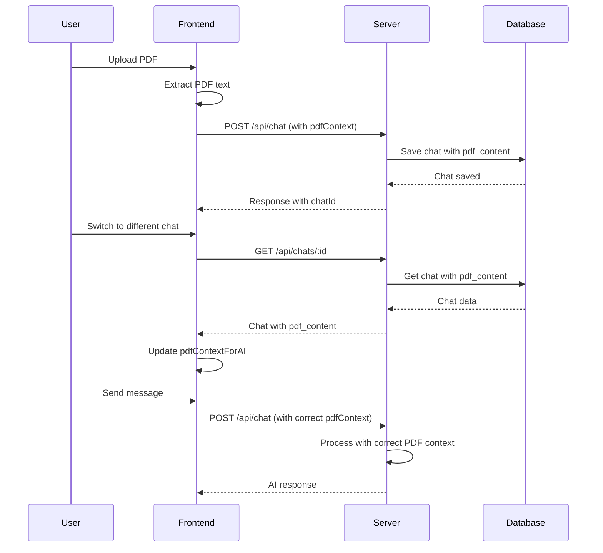

# Plan: Fix PDF-Chat Association Issue

## Problem Statement

When switching between chats, the AI responds with information from the **currently loaded PDF** (stored in browser memory), not from the PDF associated with that specific chat. Each chat should correspond to a specific PDF file, and the model should have answers for each specific file.

## Root Cause Analysis

### 1. Database Schema Issue
- The [`Chat`](../models/Chat.js) model only has: `id`, `user_id`, `title`
- **Missing**: Field to store PDF content or reference to PDF

### 2. PDF Storage Issue
- PDFs are stored in global JavaScript variables:
  - [`pdfText`](../scripts.js:36) - raw PDF text
  - [`pdfContextForAI`](../scripts.js:37) - formatted PDF context for AI
- These variables are in browser memory only, not persisted to database

### 3. Chat Loading Issue
- When [`loadChat()`](../scripts.js:1986-2058) loads a chat:
  - ✅ Retrieves messages from database
  - ❌ Does NOT retrieve associated PDF content
  - ❌ Does NOT update `pdfText` and `pdfContextForAI` variables

### 4. Message Sending Issue
- When [`sendMessage()`](../scripts.js:1134-1334) sends a message:
  - Always sends current `pdfContextForAI` (line 1186)
  - This is from the currently loaded PDF, not from the chat's PDF

## Solution Architecture

### Overview
Store PDF content in the database and associate it with each chat. When switching chats, load the associated PDF content.

### Data Flow



## Implementation Plan

### Phase 1: Database Schema Changes

#### 1.1 Update Chat Model
**File**: [`models/Chat.js`](../models/Chat.js)

Add `pdf_content` field to store PDF text:
```javascript
pdf_content: {
    type: DataTypes.TEXT,
    allowNull: true,
    defaultValue: null
}
```

**Migration Required**: Since this is a development environment, we can:
- Option A: Drop and recreate the table (easiest for development)
- Option B: Create a migration script (better for production)

### Phase 2: Backend API Changes

#### 2.1 Update Chat Creation Endpoint
**File**: [`server.js`](../server.js) - POST `/api/chat` endpoint (lines 204-478)

**Changes**:
- When creating a new chat, save `pdfContext` to `pdf_content` field
- When updating an existing chat, update `pdf_content` if provided

**Location**: Around line 388-398 (chat creation logic)

```javascript
chat = await Chat.create({
    user_id: req.user.id,
    title: generateChatTitle(body.messages?.[0]?.content),
    pdf_content: body.pdfContext || null  // Add this line
});
```

#### 2.2 Update Chat Retrieval Endpoint
**File**: [`server.js`](../server.js) - GET `/api/chats/:id` endpoint (lines 777-805)

**Changes**:
- Include `pdf_content` in the response
- Ensure the field is returned when fetching a chat

**Location**: Around line 787-794

```javascript
const chat = await Chat.findOne({
    where: { id: req.params.id, user_id: req.user.id || req.user.userId },
    include: [{ model: Message }],
    order: [[Message, 'createdAt', 'ASC']],
    attributes: ['id', 'title', 'updatedAt', 'pdf_content']  // Add pdf_content
});
```

#### 2.3 Update Chat List Endpoint
**File**: [`server.js`](../server.js) - GET `/api/chats` endpoint (lines 710-735)

**Changes**:
- Include `pdf_content` in the list response (optional, for preview)

**Location**: Around line 720-726

```javascript
const chats = await Chat.findAll({
    where: { user_id: req.user.id || req.user.userId },
    order: [['updatedAt', 'DESC']],
    limit: 50,
    attributes: ['id', 'title', 'updatedAt', 'pdf_content']  // Add pdf_content
});
```

### Phase 3: Frontend Changes

#### 3.1 Update PDF Upload Handler
**File**: [`scripts.js`](../scripts.js) - [`handlePdfUpload()`](../scripts.js:977-1042)

**Changes**:
- After extracting PDF text, store it in a temporary variable
- When the first message is sent, the PDF context will be saved with the chat

**Note**: The current implementation already sends `pdfContext` in the API request (line 1186), so this part is mostly working correctly. We just need to ensure it's saved to the database.

#### 3.2 Update Chat Loading Function
**File**: [`scripts.js`](../scripts.js) - [`loadChat()`](../scripts.js:1986-2058)

**Changes**:
- After loading chat messages, also load the `pdf_content`
- Update global variables `pdfText` and `pdfContextForAI` with the chat's PDF content
- Update PDF viewer UI if PDF content exists

**Location**: Around line 2018-2048

```javascript
const data = await response.json();
const chat = data.chat || data;
const messages = chat.Messages || [];
const pdfContent = chat.pdf_content || null;  // Add this line

// Update PDF context variables
if (pdfContent) {
    pdfText = pdfContent;
    pdfContextForAI = pdfContent;  // Or rebuild with page markers if needed
    
    // Update PDF status UI
    document.getElementById('pdfStatus').innerHTML = 
        '<i class="fas fa-check-circle" style="color: var(--emerald);"></i> PDF cargado desde chat';
} else {
    // Clear PDF context if chat has no PDF
    pdfText = "";
    pdfContextForAI = "";
    document.getElementById('pdfStatus').innerHTML = 
        '<i class="fas fa-info-circle"></i> Este chat no tiene PDF asociado';
}
```

#### 3.3 Update New Chat Function
**File**: [`scripts.js`](../scripts.js) - [`createNewChat()`](../scripts.js:1783-1809)

**Changes**:
- Clear PDF context when creating a new chat
- Reset PDF viewer UI

**Location**: Around line 1786-1808

```javascript
// Resetear estado local
currentChatId = null;
pendingUserMessages = [];
hasAIResponded = false;
history = [];

// Clear PDF context
pdfText = "";
pdfContextForAI = "";
pdfTextByPage = [];
pdfDocument = null;
currentPage = 1;
totalPages = 0;

// Clear PDF viewer UI
document.getElementById('pdfStatus').innerHTML = '';
document.getElementById('pdfControls').style.display = 'none';
document.getElementById('pdfViewer').innerHTML = '';
```

#### 3.4 Update Chat Deletion Function
**File**: [`scripts.js`](../scripts.js) - [`deleteChat()`](../scripts.js:1921-1981)

**Changes**:
- If deleting the current chat, clear PDF context
- Reset PDF viewer UI

**Location**: Around line 1951-1972

```javascript
// Si se eliminó el chat actual, limpiar UI
if (currentChatId === chatId) {
    currentChatId = null;
    history = [];
    pendingUserMessages = [];
    hasAIResponded = false;
    
    // Clear PDF context
    pdfText = "";
    pdfContextForAI = "";
    pdfTextByPage = [];
    pdfDocument = null;
    
    // Limpiar chat UI
    const chatMessages = document.getElementById('chatMessages');
    if (chatMessages) {
        chatMessages.innerHTML = `
            <div class="msg ai">
                <div class="ai-avatar">
                    <i class="fas fa-robot"></i>
                </div>
                <div class="msg-content">
                    <strong>Neotesis IA:</strong> Chat eliminado. Sube un PDF y podré responder preguntas específicas sobre su contenido.
                </div>
            </div>
        `;
    }
}
```

### Phase 4: Database Migration

#### 4.1 Create Migration Script
**File**: `migrations/add_pdf_content_to_chats.js`

Create a migration script to add the `pdf_content` column to the `chats` table:

```javascript
const { sequelize } = require('../config/database');

async function migrate() {
    try {
        console.log('Adding pdf_content column to chats table...');
        
        await sequelize.query(`
            ALTER TABLE chats 
            ADD COLUMN pdf_content TEXT 
            AFTER title
        `);
        
        console.log('Migration completed successfully!');
        process.exit(0);
    } catch (error) {
        console.error('Migration failed:', error);
        process.exit(1);
    }
}

migrate();
```

#### 4.2 Run Migration
Execute the migration script:
```bash
node migrations/add_pdf_content_to_chats.js
```

### Phase 5: Testing

#### 5.1 Test Scenarios

1. **Create new chat with PDF**:
   - Upload a PDF
   - Send a question
   - Verify chat is saved with PDF content

2. **Switch between chats**:
   - Create Chat A with PDF A
   - Create Chat B with PDF B
   - Switch to Chat A and ask a question
   - Verify AI responds with information from PDF A
   - Switch to Chat B and ask a question
   - Verify AI responds with information from PDF B

3. **Load existing chat**:
   - Reload the page
   - Load a chat with PDF
   - Verify PDF context is loaded correctly
   - Ask a question and verify correct response

4. **Delete chat**:
   - Delete a chat with PDF
   - Verify PDF context is cleared
   - Verify PDF viewer is reset

5. **Create new chat**:
   - Switch from a chat with PDF to a new chat
   - Verify PDF context is cleared
   - Verify PDF viewer is reset

## Edge Cases to Consider

1. **Chat without PDF**: Some chats may not have an associated PDF. The system should handle this gracefully.
2. **Large PDF content**: PDF text can be very large. Consider:
   - Setting a maximum size limit (already exists: `MAX_PDF_CONTEXT = 12000`)
   - Truncating PDF content before saving to database
3. **Multiple PDF uploads**: If user uploads a new PDF while in an existing chat, should it:
   - Update the chat's PDF content?
   - Create a new chat?
   - Current behavior: Updates the global PDF context, but doesn't update the chat's PDF content
4. **Database storage limits**: TEXT fields in MySQL/PostgreSQL can store up to 65,535 bytes. For larger PDFs, consider using LONGTEXT or storing in a separate table.

## Alternative Approaches Considered

### Option 1: Store PDF File in Database
- **Pros**: Can reconstruct PDF viewer with full functionality
- **Cons**: Large storage requirements, more complex implementation
- **Decision**: Not chosen - storing text content is sufficient for AI responses

### Option 2: Store PDF Reference (File Path)
- **Pros**: Smaller database size
- **Cons**: Requires file system management, potential file loss issues
- **Decision**: Not chosen - storing text content is simpler and more reliable

### Option 3: Client-Side PDF Storage Only
- **Pros**: No database changes needed
- **Cons**: PDF context lost on page refresh, can't switch between chats
- **Decision**: Not chosen - this is the current problematic behavior

## Summary of Changes

### Files to Modify:
1. [`models/Chat.js`](../models/Chat.js) - Add `pdf_content` field
2. [`server.js`](../server.js) - Update chat API endpoints to handle PDF content
3. [`scripts.js`](../scripts.js) - Update chat loading, creation, and deletion functions
4. `migrations/add_pdf_content_to_chats.js` - Create migration script (new file)

### Key Changes:
- Add `pdf_content` field to Chat model
- Save PDF context when creating/updating chats
- Load PDF context when retrieving chats
- Update frontend to use chat's PDF context when switching chats
- Clear PDF context when creating new chats or deleting current chat

## Success Criteria

✅ Each chat is associated with a specific PDF (or no PDF)
✅ When switching chats, the AI uses the correct PDF context
✅ PDF context is persisted in the database
✅ PDF context is loaded correctly when retrieving a chat
✅ PDF context is cleared when creating a new chat or deleting the current chat
✅ System handles chats without PDFs gracefully
