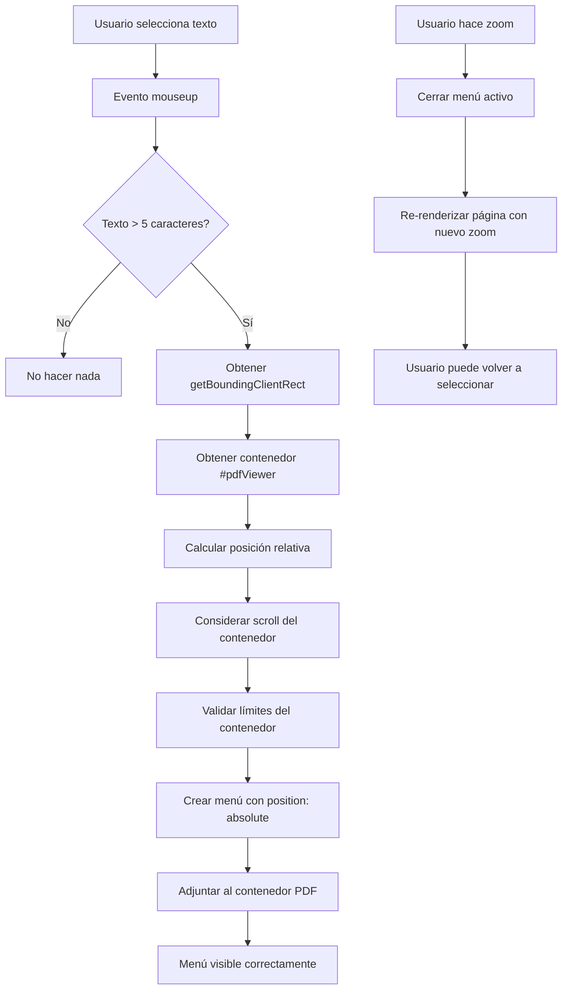

# Plan: Solución para Selector de Texto en PDF con Zoom Adaptable

## Problema Identificado

### 1. Desbordamiento del Selector sobre el Texto
El menú de selección (`.selection-menu`) se posiciona incorrectamente y desborda sobre el texto seleccionado en lugar de aparecer encima de él.

**Causa raíz:**
- El menú usa `position: fixed` con coordenadas calculadas por `getBoundingClientRect()`
- No considera el scroll del contenedor `#pdfViewer` que tiene `overflow-y: auto`
- Las coordenadas son relativas al viewport del navegador, no al contenedor scrolleable

### 2. No se Adapta al Zoom del PDF
Cuando se hace zoom (+/-) en el visor PDF, el selector no recalcula su posición correctamente.

**Causa raíz:**
- El evento `mouseup` solo se dispara una vez al seleccionar texto
- No hay listener para cambios de zoom que actualice la posición del menú activo
- El menú mantiene coordenadas fijas que no se escalan con el zoom

## Análisis Técnico

### Estructura Actual

```
#pdfViewer (overflow-y: auto, position: relative)
  └── .pdf-page-container
      ├── canvas (renderizado del PDF)
      ├── .highlight-layer (resaltados de referencias)
      └── .textLayer (capa de texto seleccionable de PDF.js)
          └── [texto seleccionable]

document.body
  └── .selection-menu (position: fixed) ❌ PROBLEMA
```

### Código Problemático

**Archivo:** [`scripts.js`](scripts.js:1275-1323)

```javascript
function handleTextSelection(e) {
    const selection = window.getSelection();
    const selectedText = selection.toString().trim();
    
    if (selectedText.length > 5) {
        const range = selection.getRangeAt(0);
        const rect = range.getBoundingClientRect(); // ❌ Coordenadas del viewport
        
        const menu = document.createElement('div');
        menu.className = 'selection-menu';
        menu.style.top = `${rect.top - 45}px`; // ❌ No considera scroll
        menu.style.left = `${rect.left + rect.width / 2}px`;
        menu.style.transform = 'translateX(-50%)';
        
        document.body.appendChild(menu); // ❌ Fuera del contenedor scrolleable
        activeSelectionMenu = menu;
    }
}
```

## Solución Propuesta

### Estrategia 1: Posicionamiento Absoluto Relativo al Contenedor

Cambiar de `position: fixed` a `position: absolute` y adjuntar el menú al contenedor PDF scrolleable.

#### Ventajas
- ✅ Se mueve naturalmente con el scroll
- ✅ Coordenadas más simples de calcular
- ✅ Mejor integración con la estructura del DOM

#### Cambios Necesarios

**1. Modificar [`handleTextSelection`](scripts.js:1275) en scripts.js:**

```javascript
function handleTextSelection(e) {
    const selection = window.getSelection();
    const selectedText = selection.toString().trim();
    
    // Eliminar menú anterior si existe
    if (activeSelectionMenu) {
        activeSelectionMenu.remove();
        activeSelectionMenu = null;
    }
    
    if (selectedText.length > 5) {
        const range = selection.getRangeAt(0);
        const rect = range.getBoundingClientRect();
        
        // Obtener el contenedor del PDF
        const pdfViewer = document.getElementById('pdfViewer');
        if (!pdfViewer) return;
        
        const viewerRect = pdfViewer.getBoundingClientRect();
        
        // Calcular posición relativa al contenedor (considerando scroll)
        const relativeTop = rect.top - viewerRect.top + pdfViewer.scrollTop;
        const relativeLeft = rect.left - viewerRect.left + pdfViewer.scrollLeft;
        
        const menu = document.createElement('div');
        menu.className = 'selection-menu';
        
        // Posicionar relativo al contenedor
        menu.style.top = `${relativeTop - 45}px`;
        menu.style.left = `${relativeLeft + rect.width / 2}px`;
        menu.style.transform = 'translateX(-50%)';
        
        const btn = document.createElement('button');
        btn.innerHTML = '<span class="material-icons-round" style="font-size:16px">chat</span> Preguntar sobre esto';
        btn.onclick = () => {
            const userInput = document.getElementById('userInput');
            if (userInput) {
                userInput.value = `Sobre el fragmento: "${selectedText}"... `;
                userInput.focus();
                userInput.selectionStart = userInput.selectionEnd = userInput.value.length;
                menu.remove();
                activeSelectionMenu = null;
            }
        };
        
        menu.appendChild(btn);
        
        // Adjuntar al contenedor PDF en lugar de body
        pdfViewer.appendChild(menu);
        activeSelectionMenu = menu;
        
        // Cerrar menú al hacer clic fuera
        const closeMenu = (event) => {
            if (!menu.contains(event.target)) {
                menu.remove();
                activeSelectionMenu = null;
                document.removeEventListener('mousedown', closeMenu);
            }
        };
        setTimeout(() => document.addEventListener('mousedown', closeMenu), 10);
    }
}
```

**2. Modificar CSS en [`styles.css`](styles.css:932):**

```css
/* Botón flotante de selección */
.selection-menu {
  position: absolute; /* ✅ Cambio de fixed a absolute */
  z-index: 1000;
  display: flex;
  gap: 8px;
  background: #0f172a;
  padding: 6px 12px;
  border-radius: 12px;
  box-shadow: 0 10px 25px rgba(0, 0, 0, 0.2);
  animation: slideUp 0.2s ease-out;
  pointer-events: auto;
}
```

**3. Asegurar que el contenedor PDF tenga `position: relative`:**

Verificar en [`styles.css`](styles.css) que `#pdfViewer` tenga:

```css
#pdfViewer {
  position: relative; /* ✅ Necesario para position: absolute de hijos */
  /* ... otros estilos existentes ... */
}
```

### Estrategia 2: Actualizar Posición al Hacer Zoom

Agregar un listener que actualice la posición del menú activo cuando cambia el zoom.

#### Cambios Necesarios

**1. Modificar [`zoomPDF`](scripts.js:1349) en scripts.js:**

```javascript
async function zoomPDF(delta) {
    currentZoom = Math.max(0.5, Math.min(3.0, currentZoom + delta));
    
    // Cerrar menú de selección activo antes de re-renderizar
    if (activeSelectionMenu) {
        activeSelectionMenu.remove();
        activeSelectionMenu = null;
    }
    
    // Si estamos en vista HTML, llamar a renderPage para actualizar el tamaño de fuente
    if (isHtmlView) {
        await renderPage(currentPage);
    } else {
        // En vista Canvas, renderPage maneja el zoom internamente
        await renderPage(currentPage);
    }
    
    updatePageNavigation();
}
```

**Justificación:** Al cerrar el menú antes de re-renderizar, evitamos que quede en una posición incorrecta. El usuario puede volver a seleccionar el texto después del zoom si lo necesita.

### Estrategia 3: Mejorar la Experiencia con Límites del Contenedor

Agregar lógica para evitar que el menú se salga de los límites visibles del contenedor.

#### Cambios Necesarios

**Agregar validación de límites en [`handleTextSelection`](scripts.js:1275):**

```javascript
// Después de calcular relativeTop y relativeLeft
const menuHeight = 45; // Altura aproximada del menú
const menuWidth = 200; // Ancho aproximado del menú

// Ajustar si se sale por arriba
let finalTop = relativeTop - menuHeight;
if (finalTop < pdfViewer.scrollTop) {
    // Si no hay espacio arriba, colocar debajo del texto
    finalTop = relativeTop + rect.height + 10;
}

// Ajustar si se sale por los lados
let finalLeft = relativeLeft + rect.width / 2;
const maxLeft = pdfViewer.scrollWidth - menuWidth / 2;
const minLeft = menuWidth / 2;
finalLeft = Math.max(minLeft, Math.min(maxLeft, finalLeft));

menu.style.top = `${finalTop}px`;
menu.style.left = `${finalLeft}px`;
```

## Diagrama de Flujo de la Solución



## Archivos a Modificar

### 1. [`scripts.js`](scripts.js)
- **Líneas 1275-1323:** Función `handleTextSelection`
  - Cambiar cálculo de posición para usar coordenadas relativas
  - Adjuntar menú a `#pdfViewer` en lugar de `document.body`
  - Agregar validación de límites del contenedor

- **Líneas 1349-1361:** Función `zoomPDF`
  - Agregar cierre del menú activo antes de re-renderizar

### 2. [`styles.css`](styles.css)
- **Línea 933:** Clase `.selection-menu`
  - Cambiar `position: fixed` a `position: absolute`

- **Verificar:** Clase `#pdfViewer`
  - Asegurar que tenga `position: relative`

## Casos de Prueba

### Caso 1: Selección de Texto sin Zoom
**Pasos:**
1. Cargar un PDF
2. Seleccionar texto en el medio de la página
3. Verificar que el menú aparece encima del texto seleccionado

**Resultado esperado:** ✅ Menú posicionado correctamente encima del texto

### Caso 2: Selección con Scroll
**Pasos:**
1. Cargar un PDF largo
2. Hacer scroll hacia abajo
3. Seleccionar texto
4. Verificar posición del menú

**Resultado esperado:** ✅ Menú aparece en la posición correcta relativa al texto, no al viewport

### Caso 3: Zoom In (Agrandar)
**Pasos:**
1. Cargar un PDF
2. Seleccionar texto (menú aparece)
3. Hacer clic en zoom + (agrandar)
4. Verificar que el menú desaparece
5. Seleccionar texto nuevamente

**Resultado esperado:** ✅ Menú se cierra al hacer zoom y aparece correctamente al volver a seleccionar

### Caso 4: Zoom Out (Achicar)
**Pasos:**
1. Cargar un PDF con zoom 200%
2. Seleccionar texto
3. Hacer clic en zoom - (achicar)
4. Verificar comportamiento

**Resultado esperado:** ✅ Menú se cierra al hacer zoom y funciona correctamente después

### Caso 5: Selección en el Borde Superior
**Pasos:**
1. Seleccionar texto en la primera línea del PDF
2. Verificar posición del menú

**Resultado esperado:** ✅ Si no hay espacio arriba, el menú aparece debajo del texto

### Caso 6: Selección en el Borde Lateral
**Pasos:**
1. Seleccionar texto en el extremo izquierdo o derecho
2. Verificar posición del menú

**Resultado esperado:** ✅ Menú se ajusta para no salirse del contenedor

## Consideraciones Adicionales

### Compatibilidad
- ✅ La solución usa APIs estándar del DOM (getBoundingClientRect, scrollTop, scrollLeft)
- ✅ Compatible con todos los navegadores modernos
- ✅ No requiere librerías adicionales

### Rendimiento
- ✅ Cálculos simples de coordenadas (operaciones matemáticas básicas)
- ✅ No hay re-renderizado innecesario
- ✅ El menú se elimina del DOM cuando no se usa

### Accesibilidad
- ⚠️ Considerar agregar soporte de teclado para cerrar el menú (tecla Escape)
- ⚠️ Agregar atributos ARIA para lectores de pantalla

### Mejoras Futuras (Opcional)
1. **Animación suave al reposicionar:** Si el menú está activo y se hace scroll, podría seguir al texto
2. **Múltiples opciones en el menú:** Agregar "Copiar", "Resaltar", etc.
3. **Persistencia de selección:** Mantener el texto seleccionado visible después de hacer zoom

## Resumen de Cambios

| Archivo | Líneas | Cambio | Impacto |
|---------|--------|--------|---------|
| [`scripts.js`](scripts.js:1275) | 1275-1323 | Refactorizar `handleTextSelection` | Alto - Soluciona el problema principal |
| [`scripts.js`](scripts.js:1349) | 1349-1361 | Modificar `zoomPDF` | Medio - Mejora la experiencia con zoom |
| [`styles.css`](styles.css:932) | 933 | Cambiar `position: fixed` a `absolute` | Alto - Necesario para la solución |
| [`styles.css`](styles.css) | Verificar | Asegurar `position: relative` en `#pdfViewer` | Alto - Necesario para la solución |

## Próximos Pasos

1. ✅ Revisar y aprobar este plan
2. Cambiar a modo **Code** para implementar los cambios
3. Probar cada caso de prueba documentado
4. Ajustar si es necesario basándose en las pruebas
5. Documentar cualquier comportamiento inesperado

---

**Nota:** Este plan está listo para implementación. Los cambios son quirúrgicos y no afectan otras funcionalidades del sistema.
