# Plan Detallado de Migración CSS → Tailwind CSS

## 📋 Resumen Ejecutivo

**Objetivo**: Migrar gradualmente todos los estilos de [`styles.css`](../styles.css:1) (1933 líneas) a Tailwind CSS, reduciendo el tamaño del proyecto mientras se mantiene el diseño exacto.

**Archivos principales afectados**:
- [`index.html`](../index.html:1) - Agregar Tailwind CDN y convertir clases CSS a clases Tailwind
- [`styles.css`](../styles.css:1) - Reducir de 1933 líneas a ~50 líneas (solo animaciones custom)

**Restricciones críticas**:
- ✅ NO cambiar IDs - JavaScript depende de ellos
- ✅ NO cambiar event handlers - `onclick`, `onchange`, etc. deben permanecer
- ✅ NO modificar [`scripts.js`](../scripts.js:1) - Solo HTML y CSS
- ✅ Mantener estructura HTML - Solo cambiar clases, no estructura
- ✅ Diseño pixel-perfect - Colores, espaciados deben ser exactos
- ✅ No romper backend - Solo cambios frontend

---

## 🎯 Métricas de Éxito Esperadas

| Métrica | Antes | Después | Mejora |
|---------|-------|---------|--------|
| Líneas en styles.css | 1933 | ~50 | 97.4% reducción |
| Tamaño de styles.css | ~60KB | ~1.5KB | 97.5% reducción |
| Clases CSS custom | ~180 | 0 | 100% eliminadas |
| Tiempo de carga CSS | ~50ms | ~10ms | 80% mejora |

---

## 📊 Flujo de Trabajo de Migración

```mermaid
graph TD
    A[Configuración Inicial] --> B[Core Components]
    B --> C[Forms & Inputs]
    C --> D[Citation Tools]
    D --> E[Sample Calculator]
    E --> F[PDF Chat Layout]
    F --> G[Chat Components]
    G --> H[Quota Monitor]
    H --> I[Auth Components]
    I --> J[Chat List]
    J --> K[Responsive Design]
    K --> L[Cleanup styles.css]
    L --> M[Testing Visual]
    M --> N[Entrega Final]
```



---

## ⚙️ FASE 1: Configuración Inicial

### Tarea 1.1: Agregar Tailwind CDN

**Archivo**: [`index.html`](../index.html:1)

**Ubicación**: Dentro de `<head>`, ANTES de `<link rel="stylesheet" href="styles.css">` (línea 19)

**Código a agregar**:
```html
<script src="https://cdn.tailwindcss.com"></script>
<script>
  tailwind.config = {
    theme: {
      extend: {
        colors: {
          primary: '#0f172a',
          'primary-light': '#1e293b',
          accent: '#2563eb',
          'accent-hover': '#1d4ed8',
          'accent-glow': 'rgba(37, 99, 235, 0.2)',
          emerald: '#10b981',
          'bg-light': '#f8fafc',
          'text-dark': '#1e293b',
          'text-gray': '#64748b',
          white: '#ffffff',
          glass: 'rgba(255, 255, 255, 0.8)',
          border: '#e2e8f0',
        },
        fontFamily: {
          sans: ['Inter', 'system-ui', '-apple-system', 'sans-serif'],
        },
        boxShadow: {
          'glow': '0 10px 15px -3px rgba(37, 99, 235, 0.2)',
          'card': '0 4px 6px -1px rgba(0, 0, 0, 0.05)',
          'card-hover': '0 20px 25px -5px rgba(0, 0, 0, 0.1)',
          'hero': '0 25px 50px -12px rgba(0, 0, 0, 0.15)',
          'modal': '0 25px 50px -12px rgba(0, 0, 0, 0.25)',
        },
      }
    }
  }
</script>
```

**Verificación**: Abrir [`index.html`](../index.html:1) en navegador y verificar que Tailwind se carga (inspeccionar elementos)

---

## 📝 FASE 2: Componentes Core

### Tarea 2.1: Header/Navigation

**Elementos a migrar**:
- `<header>` (línea 24)
- `.nav-container` (línea 25)
- `.logo` (línea 26)
- `nav ul` (línea 33)
- `nav a` (líneas 34-40)
- `.hamburger` (línea 30)

**Mapeo de clases**:

| Clase CSS Actual | Clase Tailwind |
|-----------------|---------------|
| `header` | `bg-glass backdrop-blur-xl border-b border-border sticky top-0 z-50` |
| `.nav-container` | `max-w-7xl mx-auto px-8 py-4 flex justify-between items-center relative` |
| `.logo` | `text-2xl font-extrabold text-primary cursor-pointer flex items-center gap-2 tracking-tight` |
| `nav ul` | `flex gap-10 list-none` |
| `nav a` | `text-text-dark font-semibold text-sm transition-all hover:text-accent cursor-pointer relative` |
| `nav a::after` | `absolute bottom-1 left-0 w-0 h-0.5 bg-accent transition-all duration-300` |
| `nav a:hover::after, nav a.active::after` | `w-full` |
| `.hamburger` | `bg-accent hover:bg-accent-hover text-white p-4 rounded-lg transition-all duration-300 ml-auto order-1 hidden` |

**Eliminar de [`styles.css`](../styles.css:1)**: Bloque `/* --- Navigation --- */` (líneas 36-138)

---

### Tarea 2.2: Botones (3 variantes)

**Elementos a migrar**:
- Todos los `<button class="btn">`
- Todos los `<a class="btn">`
- `.btn-secondary`
- `.btn-whatsapp`

**Mapeo de clases**:

| Clase CSS Actual | Clase Tailwind |
|-----------------|---------------|
| `.btn` | `bg-accent hover:bg-accent-hover text-white py-3 px-7 rounded-full font-bold inline-flex items-center gap-3 transition-all duration-300 hover:scale-105 shadow-glow border-none cursor-pointer text-base w-fit` |
| `.btn-secondary` | `bg-gray-100 hover:bg-gray-200 text-primary py-3 px-7 rounded-full font-bold inline-flex items-center gap-3 transition-all duration-300 border-none cursor-pointer text-base w-fit` |
| `.btn-whatsapp` | `bg-[#25D366] hover:bg-[#1ebc57] text-white py-3 px-7 rounded-full font-bold inline-flex items-center gap-3 transition-all duration-300 border-none cursor-pointer text-base w-fit` |

**Eliminar de [`styles.css`](../styles.css:1)**: Bloque `/* Buttons */` (líneas 311-351)

---

### Tarea 2.3: Hero Section

**Elementos a migrar**:
- `.hero-section` (línea 50)
- `.hero-content` (línea 51)
- `.hero-content h1` (línea 52)
- `.hero-content p` (línea 53)
- `.hero-image` (línea 60)
- `.hero-image img` (línea 61)

**Mapeo de clases**:

| Clase CSS Actual | Clase Tailwind |
|-----------------|---------------|
| `.hero-section` | `py-16 px-8 max-w-7xl mx-auto grid lg:grid-cols-2 items-center gap-16` |
| `.hero-content h1` | `text-[3.5rem] font-extrabold leading-tight text-primary mb-6 tracking-tight` |
| `.hero-content p` | `text-xl text-text-gray mb-10 max-w-lg` |
| `.hero-image` | `relative` |
| `.hero-image img` | `w-full rounded-3xl shadow-hero` |
| `.hero-image::before` | `absolute -top-5 -right-5 w-25 h-25 bg-accent-glow rounded-full z-[-1]` |

**Eliminar de [`styles.css`](../styles.css:1)**: Bloque `/* Hero */` (líneas 168-215)

---

### Tarea 2.4: Trust Bar

**Elementos a migrar**:
- `.trust-bar` (línea 67)
- `.trust-container` (línea 68)
- `.trust-container h3` (línea 69)
- `.university-logos` (línea 70)
- `.uni-logo` (líneas 71-74)

**Mapeo de clases**:

| Clase CSS Actual | Clase Tailwind |
|-----------------|---------------|
| `.trust-bar` | `bg-white py-8 border-t border-b border-border` |
| `.trust-container` | `max-w-7xl mx-auto text-center` |
| `.trust-container h3` | `uppercase text-xs tracking-widest text-text-gray mb-6` |
| `.university-logos` | `flex flex-wrap justify-center gap-8` |
| `.uni-logo` | `font-bold text-gray-400 flex items-center gap-2 text-base` |

**Eliminar de [`styles.css`](../styles.css:1)**: Bloque `/* Stats/Trust Bar */` (líneas 217-253)

---

### Tarea 2.5: Tools Section

**Elementos a migrar**:
- `.tools-section` (línea 80)
- `.section-header` (línea 81)
- `.section-header h2` (línea 82)
- `.tools-grid` (línea 85)
- `.tool-card` (líneas 86-120)
- `.tool-card i`
- `.tool-card h3`
- `.tool-card p`

**Mapeo de clases**:

| Clase CSS Actual | Clase Tailwind |
|-----------------|---------------|
| `.tools-section` | `py-16 px-8 max-w-7xl mx-auto` |
| `.section-header` | `text-center mb-8` |
| `.section-header h2` | `text-4xl text-primary mb-4` |
| `.tools-grid` | `grid md:grid-cols-2 lg:grid-cols-3 gap-8` |
| `.tool-card` | `bg-white p-12 rounded-3xl shadow-card transition-all duration-300 border border-border flex flex-col gap-6 hover:-translate-y-2.5 hover:shadow-card-hover hover:border-accent` |
| `.tool-card i` | `text-4xl text-accent` |
| `.tool-card h3` | `text-2xl text-primary font-semibold` |
| `.tool-card p` | `text-text-gray` |

**Eliminar de [`styles.css`](../styles.css:1)**: Bloque `/* Tools Section */` (líneas 255-309)

---

## 📝 FASE 3: Forms e Inputs

### Tarea 3.1: Form Components

**Elementos a migrar**:
- Todos los `.form-group`
- Todos los `.form-group label`
- Todos los `.form-control`
- Todos los `.input-with-icon`
- Todos los `.input-with-icon i`

**Mapeo de clases**:

| Clase CSS Actual | Clase Tailwind |
|-----------------|---------------|
| `.form-group` | `mb-8` |
| `.form-group label` | `block mb-3 font-bold text-primary flex items-center gap-2 text-sm` |
| `.form-group label i` | `text-xs opacity-60` |
| `.form-control` | `w-full p-4 border-2 border-border rounded-xl text-base transition-colors focus:outline-none focus:border-accent bg-white` |
| `.input-with-icon` | `relative flex items-center` |
| `.input-with-icon i` | `absolute left-4 text-text-gray text-lg` |
| `.input-with-icon .form-control` | Agregar `pl-12` a las clases existentes |

**Eliminar de [`styles.css`](../styles.css:1)**: Bloques form-related (líneas 441-494)

---

## 📝 FASE 4: Citation Tools

### Tarea 4.1: Citation Tabs and Cards

**Elementos a migrar**:
- `.citation-tabs` (línea 147)
- `.tab-buttons` (línea 148)
- `.tab-btn` (líneas 149, 152, 155)
- `.calculator-card` (línea 208)
- `.result-box` (línea 496)

**Mapeo de clases**:

| Clase CSS Actual | Clase Tailwind |
|-----------------|---------------|
| `.tab-buttons` | `flex bg-border rounded-xl p-1 mb-8` |
| `.tab-btn` | `flex-1 py-3 px-4 border-0 bg-transparent text-text-gray rounded-lg font-semibold cursor-pointer transition-all duration-300 text-sm` |
| `.tab-btn.active` | `bg-white text-primary` |
| `.tab-btn:hover:not(.active)` | `bg-white/50 text-primary` |
| `.calculator-card` | `bg-white p-10 rounded-3xl shadow-modal border border-border flex flex-col gap-6` |
| `.result-box` | `bg-gray-50 p-8 border-l-4 border-accent mt-10 rounded-xl font-medium overflow-wrap break-word break-words` |

**Eliminar de [`styles.css`](../styles.css:1)**: Bloques de citation tools (líneas 462-500, 1431-1453)

---

## 📝 FASE 5: Sample Calculator

### Tarea 5.1: Calculator Components

**Elementos a migrar**:
- `.calc-grid` (línea 354)
- `.calc-row` (línea 378)
- `.two-column-grid` (línea 395)
- `#sampleResult` (línea 409)
- `#sampleCount` (línea 435)

**Mapeo de clases**:

| Clase CSS Actual | Clase Tailwind |
|-----------------|---------------|
| `.calc-grid` | `grid gap-6` |
| `.calc-row` | `grid grid-cols-2 gap-6` |
| `.two-column-grid` | `grid lg:grid-cols-[1.2fr_1fr] gap-10 items-start` |
| `#sampleResult` | `bg-gradient-to-br from-bg-light to-gray-100 border-2 border-blue-100 p-8 mt-0 relative overflow-hidden h-full flex flex-col justify-center min-h-[300px]` |
| `#sampleResult::before` | `absolute -top-12 -right-12 w-36 h-36 bg-accent-glow rounded-full z-0` |
| `#sampleCount` | `relative z-10 text-8xl font-black text-primary leading-none` |

**Eliminar de [`styles.css`](../styles.css:1)**: Bloques calculator (líneas 353-453)

---

## 📝 FASE 6: PDF Chat Layout

### Tarea 6.1: Three Column Layout

**Elementos a migrar**:
- `.pdf-chat-layout` (línea 420)
- `.three-column-layout` (línea 521)
- `.chat-history-sidebar` (línea 535)
- `.chat-panel-main` (línea 709)
- `.pdf-viewer-panel` (línea 720)

**Mapeo de clases**:

| Clase CSS Actual | Clase Tailwind |
|-----------------|---------------|
| `.pdf-chat-layout` | `grid lg:grid-cols-[1fr_400px] gap-0 h-[700px] bg-white rounded-3xl overflow-hidden shadow-modal border border-border md:grid-cols-1 md:h-auto` |
| `.three-column-layout` | `grid lg:grid-cols-[280px_1fr_1fr] gap-0 min-h-[750px] max-h-[calc(100vh-200px)] bg-white rounded-3xl overflow-hidden shadow-modal border border-border md:grid-cols-[220px_1fr] md:min-h-auto md:max-h-[calc(100vh-200px)] sm:grid-cols-1` |
| `.chat-history-sidebar` | `bg-bg-light border-r border-border flex flex-col min-w-[220px] max-w-[320px] h-full overflow-hidden md:border-r-0 md:border-b md:max-w-[220px] sm:max-w-full sm:border-r-0 sm:border-b` |
| `.chat-panel-main` | `flex flex-col bg-white border-r border-border min-w-0 h-full overflow-hidden md:border-r-0 sm:border-r-0 sm:border-b sm:min-h-[450px] sm:max-h-[calc(100vh-200px)]` |
| `.pdf-viewer-panel` | `flex flex-col bg-white min-w-0 h-full overflow-hidden md:min-h-[500px] md:max-h-[calc(100vh-200px)] md:border-t md:border-t-border sm:min-h-[400px]` |

**Eliminar de [`styles.css`](../styles.css:1)**: Bloques `/* --- PDF Chat Layout --- */` (líneas 507-727)

---

## 📝 FASE 7: Chat Components

### Tarea 7.1: Messages and Chat Input

**Elementos a migrar**:
- `.messages` (línea 998)
- `.msg` (línea 1034)
- `.msg.user` (línea 1041)
- `.msg.ai` (línea 1045)
- `.ai-avatar` (línea 1049)
- `.msg-content` (línea 1066)
- `.chat-input-area` (línea 1119)
- `.input-container` (línea 1125)
- `.send-btn` (línea 1139)

**Mapeo de clases**:

| Clase CSS Actual | Clase Tailwind |
|-----------------|---------------|
| `.messages` | `flex-1 p-6 overflow-y-auto overflow-x-hidden flex flex-col gap-5 bg-white min-h-0 max-h-[calc(100%-200px)] scroll-smooth scrollbar-thin` |
| `.messages::-webkit-scrollbar` | `w-2.5` |
| `.messages::-webkit-scrollbar-track` | `bg-transparent` |
| `.messages::-webkit-scrollbar-thumb` | `bg-[rgba(100,116,139,0.25)] rounded-full border-2 border-transparent bg-clip-content` |
| `.messages::-webkit-scrollbar-thumb:hover` | `bg-[rgba(100,116,139,0.4)]` |
| `.msg` | `flex gap-3 max-w-full mb-4` |
| `.msg.user` | `flex-row-reverse` |
| `.msg.ai` | `flex-row` |
| `.ai-avatar` | `w-9 h-9 rounded-full bg-accent text-white flex items-center justify-center text-sm flex-shrink-0` |
| `.msg.user .ai-avatar` | `bg-primary` |
| `.msg-content` | `flex-1 p-4 px-5 rounded-2xl text-base leading-relaxed word-wrap break-word` |
| `.msg.user .msg-content` | `bg-accent text-white rounded-br-sm` |
| `.msg.ai .msg-content` | `bg-gray-50 text-text-dark rounded-bl-sm` |
| `.chat-input-area` | `bg-bg-light border-t border-border p-6` |
| `.input-container` | `flex gap-3 mb-3` |
| `.input-container .form-control` | `flex-1 p-3 px-4 border border-border rounded-xl text-sm focus:outline-none focus:border-accent focus:shadow-[0_0_0_3px_rgba(37,99,235,0.1)]` |
| `.send-btn` | `p-3 px-5 rounded-xl bg-accent text-white border-none cursor-pointer transition-all duration-300 flex items-center justify-center hover:bg-accent-hover hover:-translate-y-px disabled:bg-border disabled:cursor-not-allowed disabled:translate-y-0` |

**Eliminar de [`styles.css`](../styles.css:1)**: Bloques de chat/messages (líneas 998-1171, 1747-1780)

---

## 📝 FASE 8: Quota Monitor

### Tarea 8.1: Quota Components

**Elementos a migrar**:
- `.quota-monitor` (línea 875)
- `.quota-info` (línea 881)
- `.status-badge` (línea 892)
- `.status-badge.active` (línea 905)
- `.status-badge.inactive` (línea 910)
- `.status-dot` (línea 915)
- `.quota-bar-container` (línea 949)
- `.quota-bar` (línea 957)
- `.quota-timer` (línea 964)

**Mapeo de clases**:

| Clase CSS Actual | Clase Tailwind |
|-----------------|---------------|
| `.quota-monitor` | `bg-bg-light p-4 px-6 border-b border-border` |
| `.quota-info` | `flex justify-between items-center mb-3 text-sm font-semibold text-text-dark` |
| `.status-badge` | `flex items-center gap-2 py-1.5 px-3 rounded-full text-xs uppercase tracking-widest font-extrabold transition-all duration-300` |
| `.status-badge.active` | `bg-[#ecfdf5] text-[#059669]` |
| `.status-badge.inactive` | `bg-[#fef2f2] text-[#dc2626]` |
| `.status-dot` | `w-2 h-2 rounded-full inline-block` |
| `.active .status-dot` | `bg-emerald shadow-[0_0_0_0_rgba(16,185,129,0.4)] animate-pulse-green` |
| `.inactive .status-dot` | `bg-red-500` |
| `.quota-bar-container` | `h-2.5 bg-border rounded-full overflow-hidden mb-2` |
| `.quota-bar` | `h-full w-full bg-gradient-to-r from-emerald to-blue-500 transition-[width] duration-500 rounded-full` |
| `.quota-timer` | `text-sm text-red-600 font-bold text-center py-2 px-4 bg-red-50 rounded-lg mt-2 animate-pulse-slow` |

**Eliminar de [`styles.css`](../styles.css:1)**: Bloque `/* --- Quota Monitor Styles --- */` (líneas 874-988, 1782-1823)

---

## 📝 FASE 9: Auth Components

### Tarea 9.1: Modal and Auth Styles

**Elementos a migrar**:
- `.modal` (línea 1468)
- `.modal.show` (línea 1482)
- `.modal-content` (línea 1486)
- `.close-modal` (línea 1497)
- `.auth-tabs` (línea 1511)
- `.auth-tab` (línea 1519)
- `.auth-tab.active` (línea 1532)
- `.auth-message` (línea 1541)
- `.auth-message.success` (línea 1549)
- `.auth-message.error` (línea 1554)
- `.auth-notification` (línea 1598)
- `.auth-notification-content` (línea 1608)

**Mapeo de clases**:

| Clase CSS Actual | Clase Tailwind |
|-----------------|---------------|
| `.modal` | `hidden fixed top-0 left-0 w-full h-full bg-black/50 z-50 items-center justify-center animate-fadeIn` |
| `.modal.show` | `flex` |
| `.modal-content` | `bg-white p-10 rounded-3xl max-w-[400px] w-[90%] relative animate-slideDown shadow-modal` |
| `.close-modal` | `absolute top-4 right-6 text-2xl cursor-pointer text-text-gray transition-colors hover:text-primary` |
| `.auth-tabs` | `flex gap-4 mb-8 border-b-2 border-border pb-2` |
| `.auth-tab` | `flex-1 p-4 border-0 bg-none text-base font-bold text-text-gray cursor-pointer transition-all rounded-lg` |
| `.auth-tab.active` | `text-accent bg-[rgba(37,99,235,0.1)]` |
| `.auth-tab:hover:not(.active)` | `text-primary` |
| `.auth-message` | `mt-6 p-4 rounded-xl text-center font-semibold` |
| `.auth-message.success` | `bg-[rgba(16,185,129,0.1)] text-emerald` |
| `.auth-message.error` | `bg-[rgba(239,68,68,0.1)] text-red-500` |
| `.auth-notification` | `bg-gradient-to-br from-[rgba(37,99,235,0.1)] to-[rgba(37,99,235,0.05)] border border-accent rounded-xl p-4 m-4 text-center animate-slideDown` |
| `.auth-notification-content` | `flex flex-col items-center gap-3` |
| `.auth-notification-content i` | `text-2xl text-accent` |
| `.auth-notification-content p` | `text-primary font-semibold m-0 text-sm` |

**Eliminar de [`styles.css`](../styles.css:1)**: Bloque `/* --- Auth Modal Styles --- */` (líneas 1467-1595, 1597-1625)

---

## 📝 FASE 10: Chat List Components

### Tarea 10.1: Chat List and Items

**Elementos a migrar**:
- `.chat-list-panel` (línea 602)
- `.chat-list-header` (línea 1846)
- `.chat-list` (línea 616)
- `.chat-item` (línea 623)
- `.chat-item:hover` (línea 636)
- `.chat-item.active` (línea 641)
- `.chat-item-icon` (línea 646)
- `.chat-item-info` (línea 659)
- `.chat-item-title` (línea 664)
- `.chat-item-date` (línea 674)
- `.chat-item-delete` (línea 680)
- `.chat-empty-state` (línea 569)
- `.chat-empty-state.visible` (línea 580)

**Mapeo de clases**:

| Clase CSS Actual | Clase Tailwind |
|-----------------|---------------|
| `.chat-list-panel` | `hidden flex-1 overflow-y-auto overflow-x-hidden p-3 min-h-0 max-h-[calc(100%-80px)] bg-bg-light border-b border-border p-4 max-h-[200px]` |
| `.chat-list-panel.visible` | `block` |
| `.chat-list-header` | `flex justify-between items-center mb-4` |
| `.chat-list-header h4` | `text-sm text-text-gray m-0 flex items-center gap-2` |
| `.chat-list` | `flex flex-col gap-2 min-h-full` |
| `.chat-item` | `flex items-center gap-3 p-3.5 px-4 bg-white rounded-xl cursor-pointer transition-all duration-200 border border-transparent relative` |
| `.chat-item:hover` | `border-accent bg-[rgba(37,99,235,0.05)]` |
| `.chat-item.active` | `border-accent bg-[rgba(37,99,235,0.1)]` |
| `.chat-item-icon` | `w-9 h-9 bg-accent rounded-lg flex items-center justify-center text-white text-sm flex-shrink-0` |
| `.chat-item-info` | `flex-1 min-w-0` |
| `.chat-item-title` | `text-sm font-semibold text-primary whitespace-nowrap overflow-hidden text-ellipsis mb-1` |
| `.chat-item-date` | `text-xs text-text-gray` |
| `.chat-item-delete` | `hidden w-7 h-7 border-none bg-transparent text-text-gray rounded-lg cursor-pointer items-center justify-center flex-shrink-0 transition-all duration-200 hover:bg-[rgba(239,68,68,0.1)] hover:text-red-500` |
| `.chat-item:hover .chat-item-delete` | `flex` |
| `.chat-empty-state` | `hidden flex-col items-center justify-center p-8 px-4 text-center text-text-gray flex-1` |
| `.chat-empty-state.visible` | `flex` |
| `.chat-empty-state i` | `text-4xl mb-4 opacity-40` |
| `.chat-empty-state p` | `text-sm font-semibold m-0 mb-2` |
| `.chat-empty-state small` | `text-xs opacity-70` |

**Eliminar de [`styles.css`](../styles.css:1)**: Bloques de chat list (líneas 601-707, 1627-1658, 1837-1933)

---

## 📝 FASE 11: Responsive Design

### Tarea 11.1: Breakpoints Migration

**Elementos a migrar**:
- `@media (max-width: 1024px)` (línea 1218)
- `@media (max-width: 992px)` (línea 1247)
- `@media (max-width: 768px)` (línea 1274)

**Estrategia de migración**:

1. **Desktop (1024px+)**: Sin prefijos (clases base)
2. **Tablet (768px - 1023px)**: Prefijo `md:`
3. **Mobile (< 768px)**: Prefijo `sm:`

**Ejemplos de conversión**:

| CSS Original | Tailwind Equivalente |
|--------------|---------------------|
| `@media (max-width: 1024px) { .hero-section { grid-template-columns: 1fr; } }` | `.hero-section { @apply lg:grid-cols-1; }` |
| `@media (max-width: 768px) { .hero-content h1 { font-size: 2.2rem; } }` | `.hero-content h1 { @apply sm:text-[2.2rem]; }` |
| `@media (max-width: 768px) { .tools-grid { grid-template-columns: 1fr; } }` | `.tools-grid { @apply sm:grid-cols-1; }` |

**Eliminar de [`styles.css`](../styles.css:1)**: Todo el bloque `@media` (líneas 1218-1429)

---

## 🧹 FASE 12: Cleanup y Optimización

### Tarea 12.1: Reducir styles.css

**Acción**: Reemplazar TODO el contenido de [`styles.css`](../styles.css:1) por SOLO esto:

```css
/* Animaciones custom no disponibles en Tailwind */
@keyframes fadeIn {
  from { opacity: 0; transform: translateY(20px); }
  to { opacity: 1; transform: translateY(0); }
}

@keyframes slideDown {
  from { opacity: 0; transform: translateY(-10px); }
  to { opacity: 1; transform: translateY(0); }
}

@keyframes pulse-green {
  0% { transform: scale(0.95); box-shadow: 0 0 0 0 rgba(16, 185, 129, 0.7); }
  70% { transform: scale(1); box-shadow: 0 0 0 6px rgba(16, 185, 129, 0); }
  100% { transform: scale(0.95); box-shadow: 0 0 0 0 rgba(16, 185, 129, 0); }
}

@keyframes pulse {
  0%, 100% { opacity: 1; }
  50% { opacity: 0.7; }
}

/* Clases de utilidad para animaciones */
.animate-fadeIn { animation: fadeIn 0.6s cubic-bezier(0.16, 1, 0.3, 1); }
.animate-slideDown { animation: slideDown 0.3s ease; }
.animate-pulse-green { animation: pulse-green 2s infinite; }
.animate-pulse-slow { animation: pulse 2s infinite; }

/* Clases de visibilidad (manejadas por JavaScript) */
.page-section { display: none; }
.page-section.active { display: block; }
.page-section.active.animate-fadeIn { animation: fadeIn 0.6s cubic-bezier(0.16, 1, 0.3, 1); }

/* Clases de utilidad para scrollbar */
.scrollbar-thin { scrollbar-width: thin; }
```

**Resultado**: [`styles.css`](../styles.css:1) se reduce de 1933 líneas a ~50 líneas

---

## ✅ FASE 13: Testing y Verificación

### Tarea 13.1: Checklist de Verificación

#### Desktop (1920x1080)
- [ ] Header sticky con blur funciona correctamente
- [ ] Hero section se ve responsive y alineado
- [ ] Tool cards tienen hover effect correcto
- [ ] Botones con 3 variantes funcionan
- [ ] Forms funcionan correctamente
- [ ] PDF chat layout es correcto (3 columnas)
- [ ] Quota monitor tiene animación
- [ ] Footer se ve correcto

#### Tablet (768x1024)
- [ ] Header responsive funciona
- [ ] Hero section se ajusta correctamente
- [ ] Tool cards se reorganizan
- [ ] PDF chat layout se ajusta (2 columnas)
- [ ] Chat messages se ven bien

#### Mobile (375x667)
- [ ] Header responsive funciona (hamburger menu)
- [ ] Hero section se ajusta
- [ ] Tool cards se apilan verticalmente
- [ ] PDF chat layout es usable (1 columna)
- [ ] Chat messages son legibles
- [ ] Botones son touch-friendly

#### Funcionalidad
- [ ] Todos los IDs permanecen iguales
- [ ] Todos los event handlers funcionan
- [ ] JavaScript no tiene errores en consola
- [ ] Animaciones funcionan correctamente
- [ ] Colores son pixel-perfect
- [ ] Backend no se ve afectado

---

## 📦 FASE 14: Entrega Final

### Tarea 14.1: Crear Documentación

**Archivo a crear**: `MIGRATION_NOTES.md`

**Contenido**:
```markdown
# Notas de Migración CSS → Tailwind CSS

## Fecha de Migración
[Fecha]

## Componentes Migrados
- Header/Navigation
- Botones (3 variantes)
- Hero Section
- Trust Bar
- Tools Section
- Forms e Inputs
- Citation Tools
- Sample Calculator
- PDF Chat Layout
- Chat Components
- Quota Monitor
- Auth Components
- Chat List Components
- Responsive Design

## Clases Tailwind Principales Utilizadas
- `bg-accent`, `text-primary`, `text-text-gray`
- `rounded-3xl`, `rounded-xl`, `rounded-full`
- `shadow-modal`, `shadow-card`, `shadow-hero`
- `flex`, `grid`, `gap-8`, `gap-6`
- `py-16`, `px-8`, `p-4`, `p-6`
- `text-4xl`, `text-2xl`, `text-sm`, `text-xs`
- `font-extrabold`, `font-semibold`, `font-bold`
- `transition-all`, `duration-300`, `hover:scale-105`

## Cambios Notables
- styles.css reducido de 1933 líneas a ~50 líneas
- Todas las animaciones custom mantenidas en styles.css
- IDs y event handlers sin cambios
- Diseño pixel-perfect mantenido

## Instrucciones de Testing
1. Abrir index.html en navegador
2. Verificar que Tailwind se carga correctamente
3. Probar todas las funcionalidades
4. Verificar diseño en Desktop, Tablet y Mobile
5. Verificar que no hay errores en consola

## Rollback
Si algo sale mal:
1. Restaurar index.html desde git
2. Restaurar styles.css desde git
3. Eliminar Tailwind CDN de index.html
4. Verificar que todo funciona como antes
```

---

## 🚨 Consideraciones Importantes

### Riesgos Potenciales

1. **Breakpoints diferentes**: Tailwind usa breakpoints diferentes a los custom
   - **Mitigación**: Usar valores arbitrarios `[valor]` cuando sea necesario

2. **Animaciones complejas**: Algunas animaciones pueden no tener equivalente exacto
   - **Mitigación**: Mantener en [`styles.css`](../styles.css:1) solo las animaciones custom

3. **Pseudo-elementos**: Tailwind no soporta todos los pseudo-elementos
   - **Mitigación**: Usar CSS custom para pseudo-elementos complejos

4. **Estado hover/active**: Tailwind usa sintaxis diferente
   - **Mitigación**: Usar prefijos `hover:`, `active:`, `focus:`

5. **Scrollbar personalizado**: Tailwind no tiene soporte nativo para scrollbar
   - **Mitigación**: Mantener estilos de scrollbar en [`styles.css`](../styles.css:1)

### Rollback Plan

Si algo sale mal:
1. Restaurar [`index.html`](../index.html:1) desde git
2. Restaurar [`styles.css`](../styles.css:1) desde git
3. Eliminar Tailwind CDN de [`index.html`](../index.html:1)
4. Verificar que todo funciona como antes

---

## 📚 Referencias

- [Tailwind CSS Documentation](https://tailwindcss.com/docs)
- [Tailwind CDN](https://cdn.tailwindcss.com)
- [Tailwind Configuration](https://tailwindcss.com/docs/configuration)
- [Tailwind Responsive Design](https://tailwindcss.com/docs/responsive-design)
- [Tailwind Hover, Focus, & Other States](https://tailwindcss.com/docs/hover-focus-and-other-states)

---

## 🎯 Próximos Pasos

1. ✅ Revisar este plan detallado
2. ✅ Aprobar plan
3. ✅ Cambiar a modo Code
4. ✅ Ejecutar migración fase por fase
5. ✅ Verificar cada componente
6. ✅ Testing completo
7. ✅ Entrega final

---

**¿Estás listo para proceder con la migración?**
