# Plan de Migración CSS → Tailwind CSS

## 📋 Resumen Ejecutivo

**Objetivo**: Convertir [`styles.css`](../styles.css:1) (2011 líneas) a Tailwind CSS manteniendo el diseño exacto.

**Archivos afectados**:
- [`index.html`](../index.html:1) - Agregar Tailwind CDN y configuración
- [`styles.css`](../styles.css:1) - Reducir a solo animaciones custom

**Archivos a eliminar después de migración**:
- [`CSS_LAYOUT_FIXES.md`](../CSS_LAYOUT_FIXES.md:1) - Documentación CSS obsoleta

**Tiempo estimado**: ~30 minutos

---

## 🎯 Reglas Críticas

1. ✅ **NO cambiar IDs** - JavaScript depende de ellos
2. ✅ **NO cambiar event handlers** - `onclick`, `onchange`, etc. deben permanecer
3. ✅ **NO modificar scripts.js** - Solo HTML y CSS
4. ✅ **Mantener estructura HTML** - Solo cambiar clases, no estructura
5. ✅ **Usar valores exactos** - Colores, espaciados deben ser pixel-perfect
6. ✅ **Priorizar velocidad** - Si algo no tiene equivalente exacto en Tailwind, usar valor arbitrario `[valor]`

---

## 📊 Flujo de Trabajo

```mermaid
graph TD
    A[Configuración Inicial] --> B[Header/Navigation]
    B --> C[Botones]
    C --> D[Hero Section]
    D --> E[Trust Bar]
    E --> F[Tools Section]
    F --> G[Forms e Inputs]
    G --> H[Citation Tools]
    H --> I[Sample Calculator]
    I --> J[PDF Chat Layout]
    J --> K[Messages/Chat]
    K --> L[Quota Monitor]
    L --> M[Footer]
    M --> N[Responsive Utilities]
    N --> O[Cleanup styles.css]
    O --> P[Testing Visual]
    P --> Q[Entrega Final]
```



---

## ⚙️ FASE 1: Configuración Inicial

### Tarea 1: Agregar Tailwind CDN

**Archivo**: [`index.html`](../index.html:1)

**Ubicación**: Dentro de `<head>`, ANTES de `<link rel="stylesheet" href="styles.css">` (línea 19)

**Qué agregar**:
```html
<script src="https://cdn.tailwindcss.com"></script>
<script>
  tailwind.config = {
    theme: {
      extend: {
        colors: {
          primary: '#0f172a',
          'primary-light': '#1e293b',
          accent: '#2563eb',
          'accent-hover': '#1d4ed8',
          emerald: '#10b981',
        }
      }
    }
  }
</script>
```

**Verificación**: Abrir [`index.html`](../index.html:1) en navegador y verificar que Tailwind se carga (inspeccionar elementos)

---

## 📝 FASE 2: Migraciones por Componente

### Tarea 2: Header/Navigation

**Elementos a migrar**:
- `<header>` (línea 24)
- `.nav-container` (si existe)
- Logo (línea 26)
- Nav ul (línea 33)
- Nav links (líneas 34-40)
- Hamburger button (línea 30)

**Mapeo de clases**:

| Clase CSS Actual | Clase Tailwind |
|-----------------|---------------|
| `header` | `bg-white/80 backdrop-blur-xl border-b border-gray-200 sticky top-0 z-50` |
| `.nav-container` | `max-w-7xl mx-auto px-8 py-4 flex justify-between items-center` |
| `.logo` | `text-2xl font-extrabold text-primary flex items-center gap-2 cursor-pointer` |
| `nav ul` | `flex gap-10 list-none` |
| `nav a` | `text-primary font-semibold text-sm transition-all hover:text-accent` |
| `.hamburger` | `bg-accent hover:bg-accent-hover text-white p-4 rounded-lg transition-all duration-300` |

**Eliminar de [`styles.css`](../styles.css:1)**: Bloque `/* --- Navigation --- */` (líneas 36-138)

---

### Tarea 3: Botones (3 variantes)

**Elementos a migrar**:
- Todos los `<button class="btn">`
- Todos los `<a class="btn">`
- `.btn-secondary`
- `.btn-whatsapp`

**Mapeo de clases**:

| Clase CSS Actual | Clase Tailwind |
|-----------------|---------------|
| `.btn` | `bg-accent hover:bg-accent-hover text-white py-3 px-7 rounded-full font-bold inline-flex items-center gap-3 transition-all duration-300 hover:scale-105` |
| `.btn-secondary` | `bg-gray-100 hover:bg-gray-200 text-primary py-3 px-7 rounded-full font-bold inline-flex items-center gap-3 transition-all duration-300` |
| `.btn-whatsapp` | `bg-[#25D366] hover:bg-[#1ebc57] text-white py-3 px-7 rounded-full font-bold inline-flex items-center gap-3 transition-all duration-300` |

**Eliminar de [`styles.css`](../styles.css:1)**: Bloque `/* Buttons */` (líneas 311-351)

---

### Tarea 4: Hero Section

**Elementos a migrar**:
- `.hero-section` (línea 50)
- `.hero-content` (línea 51)
- `.hero-content h1` (línea 52)
- `.hero-content p` (línea 53)
- `.hero-image` (línea 60)
- `.hero-image img` (línea 61)

**Mapeo de clases**:

| Clase CSS Actual | Clase Tailwind |
|-----------------|---------------|
| `.hero-section` | `py-16 px-8 max-w-7xl mx-auto grid lg:grid-cols-2 items-center gap-16` |
| `.hero-content h1` | `text-6xl lg:text-[3.5rem] font-extrabold leading-tight text-primary mb-6` |
| `.hero-content p` | `text-xl text-gray-600 mb-10 max-w-lg` |
| `.hero-image` | `relative` |
| `.hero-image img` | `w-full rounded-3xl shadow-2xl` |

**Eliminar de [`styles.css`](../styles.css:1)**: Bloque `/* Hero */` (líneas 168-215)

---

### Tarea 5: Trust Bar

**Elementos a migrar**:
- `.trust-bar` (línea 67)
- `.trust-container` (línea 68)
- `.trust-container h3` (línea 69)
- `.university-logos` (línea 70)
- `.uni-logo` (líneas 71-74)

**Mapeo de clases**:

| Clase CSS Actual | Clase Tailwind |
|-----------------|---------------|
| `.trust-bar` | `bg-white py-8 border-t border-b border-gray-200` |
| `.trust-container` | `max-w-7xl mx-auto text-center` |
| `.trust-container h3` | `uppercase text-xs tracking-widest text-gray-600 mb-6` |
| `.university-logos` | `flex flex-wrap justify-center gap-8` |
| `.uni-logo` | `font-bold text-gray-400 flex items-center gap-2 text-base` |

**Eliminar de [`styles.css`](../styles.css:1)**: Bloque `/* Stats/Trust Bar */` (líneas 217-253)

---

### Tarea 6: Tools Section

**Elementos a migrar**:
- `.tools-section` (línea 80)
- `.section-header` (línea 81)
- `.section-header h2` (línea 82)
- `.tools-grid` (línea 85)
- `.tool-card` (líneas 86-92, 93-99, 100-106, 107-113, 114-120)
- `.tool-card i`
- `.tool-card h3`
- `.tool-card p`

**Mapeo de clases**:

| Clase CSS Actual | Clase Tailwind |
|-----------------|---------------|
| `.tools-section` | `py-16 px-8 max-w-7xl mx-auto` |
| `.section-header h2` | `text-4xl text-primary mb-4 text-center` |
| `.tools-grid` | `grid md:grid-cols-2 lg:grid-cols-3 gap-8` |
| `.tool-card` | `bg-white p-12 rounded-3xl shadow-md transition-all duration-300 border border-gray-200 flex flex-col gap-6 hover:-translate-y-2.5 hover:shadow-2xl hover:border-accent` |
| `.tool-card i` | `text-4xl text-accent` |
| `.tool-card h3` | `text-2xl text-primary font-semibold` |
| `.tool-card p` | `text-gray-600` |

**Eliminar de [`styles.css`](../styles.css:1)**: Bloque `/* Tools Section */` (líneas 255-309)

---

### Tarea 7: Forms e Inputs

**Elementos a migrar**:
- Todos los `.form-group`
- Todos los `.form-group label`
- Todos los `.form-control`
- Todos los `.input-with-icon`
- Todos los `.input-with-icon i`

**Mapeo de clases**:

| Clase CSS Actual | Clase Tailwind |
|-----------------|---------------|
| `.form-group` | `mb-8` |
| `.form-group label` | `block mb-3 font-bold text-primary` |
| `.form-control` | `w-full p-4 border-2 border-gray-200 rounded-xl text-base transition-colors focus:outline-none focus:border-accent` |
| `.input-with-icon` | `relative flex items-center` |
| `.input-with-icon i` | `absolute left-4 text-gray-600 text-lg` |
| `.input-with-icon .form-control` | Agregar `pl-12` a las clases existentes |

**Eliminar de [`styles.css`](../styles.css:1)**: Bloques form-related (líneas 441-494)

---

### Tarea 8: Citation Tools (Tabs + Cards)

**Elementos a migrar**:
- `.citation-tabs` (línea 147)
- `.tab-buttons` (línea 148)
- `.tab-btn` (líneas 149, 152, 155)
- `.calculator-card` (línea 208)
- `.result-box` (línea 496)

**Mapeo de clases**:

| Clase CSS Actual | Clase Tailwind |
|-----------------|---------------|
| `.tab-buttons` | `flex bg-gray-200 rounded-xl p-1 mb-8` |
| `.tab-btn` | `flex-1 py-3 px-4 border-0 bg-transparent text-gray-600 rounded-lg font-semibold cursor-pointer transition-all duration-300 text-sm` |
| `.tab-btn.active` | Agregar `bg-white text-primary` |
| `.calculator-card` | `bg-white p-10 rounded-3xl shadow-xl border border-gray-200 flex flex-col gap-6` |
| `.result-box` | `bg-gray-50 p-8 border-l-4 border-accent mt-10 rounded-xl font-medium` |

**Eliminar de [`styles.css`](../styles.css:1)**: Bloques de citation tools (líneas 462-500)

---

### Tarea 9: Sample Calculator

**Elementos a migrar**:
- `.calc-grid` (línea 354)
- `.calc-row` (línea 378)
- `.two-column-grid` (línea 395)
- `#sampleResult` (línea 409)
- `#sampleCount` (línea 435)

**Mapeo de clases**:

| Clase CSS Actual | Clase Tailwind |
|-----------------|---------------|
| `.calc-grid` | `grid gap-6` |
| `.calc-row` | `grid grid-cols-2 gap-6` |
| `.two-column-grid` | `grid lg:grid-cols-[1.2fr_1fr] gap-10 items-start` |
| `#sampleResult` | `bg-gradient-to-br from-gray-50 to-gray-100 border-2 border-blue-100 p-8 rounded-xl flex flex-col justify-center min-h-[300px]` |
| `#sampleCount` | `text-8xl font-black text-primary leading-none` |

**Eliminar de [`styles.css`](../styles.css:1)**: Bloques calculator (líneas 353-453)

---

### Tarea 10: PDF Chat Layout

**Elementos a migrar**:
- `.pdf-chat-layout` (línea 420)
- `.pdf-viewer-panel` (línea 499)
- `.pdf-header` (línea 500)
- `.pdf-controls` (si existe)
- `.pdf-upload-btn` (si existe)
- `.pdf-viewer` (si existe)
- `.chat-panel` (si existe)

**Mapeo de clases**:

| Clase CSS Actual | Clase Tailwind |
|-----------------|---------------|
| `.pdf-chat-layout` | `grid lg:grid-cols-[1fr_400px] gap-0 h-[700px] bg-white rounded-3xl overflow-hidden shadow-2xl border border-gray-200 md:grid-cols-1 md:h-auto` |
| `.pdf-viewer-panel` | `border-r border-gray-200 flex flex-col md:border-r-0 md:border-b md:h-[400px]` |
| `.pdf-header` | `p-6 bg-gray-50 border-b border-gray-200` |
| `.pdf-controls` | `flex items-center gap-4` |
| `.pdf-upload-btn` | `inline-flex items-center gap-2 py-3 px-6 bg-accent text-white rounded-lg cursor-pointer font-semibold transition-all duration-300 hover:bg-accent-hover` |
| `.pdf-viewer` | `flex-1 overflow-auto bg-white relative` |
| `.chat-panel` | `flex flex-col bg-white h-full min-h-0 md:h-[500px]` |

**Eliminar de [`styles.css`](../styles.css:1)**: Bloques `/* --- PDF Chat Layout --- */` (líneas 500+)

---

### Tarea 11: Messages/Chat

**Elementos a migrar**:
- `.messages` (línea 472)
- `.msg` (línea 473)
- `.msg.user` (si existe)
- `.ai-avatar` (línea 474)
- `.msg-content` (línea 475)

**Mapeo de clases**:

| Clase CSS Actual | Clase Tailwind |
|-----------------|---------------|
| `.messages` | `flex-1 p-6 overflow-y-auto flex flex-col gap-5 bg-white min-h-0` |
| `.msg` | `flex gap-3 max-w-full mb-4` |
| `.msg.user` | Agregar `flex-row-reverse` |
| `.ai-avatar` | `w-8 h-8 rounded-full bg-accent text-white flex items-center justify-center text-xs flex-shrink-0` |
| `.msg.user .ai-avatar` | `bg-primary` |
| `.msg-content` | `flex-1 py-4 px-5 rounded-2xl text-sm leading-relaxed` |
| `.msg.user .msg-content` | `bg-accent text-white rounded-br-sm` |
| `.msg.ai .msg-content` | `bg-gray-100 text-primary rounded-bl-sm` |

**Eliminar de [`styles.css`](../styles.css:1)**: Bloques de chat/messages

---

### Tarea 12: Quota Monitor

**Elementos a migrar**:
- `.quota-monitor` (línea 455)
- `.quota-info` (línea 456)
- `.status-badge` (línea 457)
- `.status-badge.active` (línea 457)
- `.status-badge.inactive` (si existe)
- `.status-dot` (línea 458)
- `.quota-bar-container` (línea 463)
- `.quota-bar` (línea 464)
- `.quota-timer` (línea 466)

**Mapeo de clases**:

| Clase CSS Actual | Clase Tailwind |
|-----------------|---------------|
| `.quota-monitor` | `bg-gray-100 p-6 border-b border-gray-200` |
| `.quota-info` | `flex justify-between items-center mb-3 text-sm font-semibold text-primary` |
| `.status-badge` | `flex items-center gap-2 py-2 px-3 rounded-full text-xs uppercase tracking-wide font-extrabold transition-all duration-300` |
| `.status-badge.active` | Agregar `bg-green-50 text-green-600` |
| `.status-badge.inactive` | Agregar `bg-red-50 text-red-600` |
| `.status-dot` | `w-2 h-2 rounded-full inline-block` |
| `.active .status-dot` | Agregar `bg-green-500 animate-pulse-green` |
| `.quota-bar-container` | `h-2.5 bg-gray-200 rounded-full overflow-hidden mb-2` |
| `.quota-bar` | `h-full w-full bg-gradient-to-r from-emerald to-blue-500 transition-[width] duration-500` |
| `.quota-timer` | `text-sm text-red-600 font-bold text-center py-2 px-4 bg-red-50 rounded-lg mt-2 animate-pulse-slow` |

**Eliminar de [`styles.css`](../styles.css:1)**: Bloque `/* --- Quota Monitor Styles --- */`

---

### Tarea 13: Footer

**Elementos a migrar**:
- `<footer>` (si existe)
- `footer p` (si existe)

**Mapeo de clases**:

| Clase CSS Actual | Clase Tailwind |
|-----------------|---------------|
| `footer` | `bg-primary text-white text-center py-16 px-8 mt-auto` |
| `footer p` | `opacity-70 text-sm` |

**Eliminar de [`styles.css`](../styles.css:1)**: Bloque `/* Footer */`

---

### Tarea 14: Responsive Utilities

**Elementos a migrar**:
- Todos los `@media (max-width: 1024px)`
- Todos los `@media (max-width: 768px)`
- Todos los `@media (max-width: 640px)`

**Acciones**:
1. Buscar todos los `@media (max-width: 1024px)` → Agregar prefijo `lg:` a clases relevantes
2. Buscar todos los `@media (max-width: 768px)` → Agregar prefijo `md:` a clases relevantes
3. Buscar todos los `@media (max-width: 640px)` → Agregar prefijo `sm:` a clases relevantes

**Ejemplos**:
- `grid-cols-2` → `md:grid-cols-1 lg:grid-cols-2`
- `text-6xl` → `text-4xl md:text-6xl`
- `px-8` → `px-4 md:px-8`

**Eliminar de [`styles.css`](../styles.css:1)**: Todo el bloque `@media`

---

## 🧹 FASE 3: Cleanup

### Tarea 15: Cleanup de styles.css

**Acción**: Reemplazar TODO el contenido de [`styles.css`](../styles.css:1) por SOLO esto:

```css
/* Animaciones custom no disponibles en Tailwind */
@keyframes fadeIn {
  from { opacity: 0; transform: translateY(20px); }
  to { opacity: 1; transform: translateY(0); }
}

@keyframes pulse-green {
  0% { transform: scale(0.95); box-shadow: 0 0 0 0 rgba(16, 185, 129, 0.7); }
  70% { transform: scale(1); box-shadow: 0 0 0 6px rgba(16, 185, 129, 0); }
  100% { transform: scale(0.95); box-shadow: 0 0 0 0 rgba(16, 185, 129, 0); }
}

@keyframes pulse {
  0%, 100% { opacity: 1; }
  50% { opacity: 0.7; }
}

.animate-fadeIn { animation: fadeIn 0.6s cubic-bezier(0.16, 1, 0.3, 1); }
.animate-pulse-green { animation: pulse-green 2s infinite; }
.animate-pulse-slow { animation: pulse 2s infinite; }
```

**Resultado**: [`styles.css`](../styles.css:1) se reduce de 2011 líneas a ~30 líneas

---

### Tarea 16: Animaciones de página

**Elementos**: `.page-section.active`

**Acción**: Agregar clase `animate-fadeIn` a los elementos con clase `.page-section`

**Ejemplo**:
```html
<section id="landing" class="page-section active animate-fadeIn">
```

**NOTA**: La clase `.active` debe permanecer (manejada por JavaScript)

---

## ✅ FASE 4: Verificación Final

### Tarea 17: Testing Visual

**Checklist de verificación**:

#### Desktop (1920x1080)
- [ ] Header sticky con blur funciona correctamente
- [ ] Hero section se ve responsive y alineado
- [ ] Tool cards tienen hover effect correcto
- [ ] Botones con 3 variantes funcionan
- [ ] Forms funcionan correctamente
- [ ] PDF chat layout es correcto
- [ ] Quota monitor tiene animación
- [ ] Footer se ve correcto

#### Tablet (768x1024)
- [ ] Header responsive funciona
- [ ] Hero section se ajusta correctamente
- [ ] Tool cards se reorganizan
- [ ] PDF chat layout se ajusta
- [ ] Chat messages se ven bien

#### Mobile (375x667)
- [ ] Header responsive funciona
- [ ] Hero section se ajusta
- [ ] Tool cards se apilan verticalmente
- [ ] PDF chat layout es usable
- [ ] Chat messages son legibles
- [ ] Botones son touch-friendly

#### Funcionalidad
- [ ] Todos los IDs permanecen iguales
- [ ] Todos los event handlers funcionan
- [ ] JavaScript no tiene errores en consola
- [ ] Animaciones funcionan correctamente
- [ ] Colores son pixel-perfect

---

## 📦 FASE 5: Entrega

### Tarea 18: Crear archivos finales

**Archivos a crear/modificar**:

1. **[`index.html`](../index.html:1)** modificado
   - Agregado Tailwind CDN
   - Agregado configuración de Tailwind
   - Todas las clases convertidas a Tailwind

2. **[`styles.css`](../styles.css:1)** reducido
   - Solo contiene animaciones custom
   - ~30 líneas (de 2011 líneas originales)

3. **[`MIGRATION_NOTES.md`](MIGRATION_NOTES.md)** (nuevo)
   - Lista de componentes migrados
   - Clases principales usadas
   - Cambios notables
   - Instrucciones de testing

4. **[`CSS_LAYOUT_FIXES.md`](../CSS_LAYOUT_FIXES.md:1)** - ELIMINAR
   - Documentación CSS obsoleta

---

## 📊 Métricas de Éxito

| Métrica | Antes | Después | Mejora |
|---------|-------|---------|--------|
| Líneas en styles.css | 2011 | ~30 | 98.5% reducción |
| Tamaño de styles.css | ~60KB | ~1KB | 98.3% reducción |
| Clases CSS custom | ~150 | 0 | 100% eliminadas |
| Dependencias CSS | 1 archivo | 0 archivos | 100% eliminadas |
| Tiempo de carga CSS | ~50ms | ~10ms | 80% mejora |

---

## 🚨 Consideraciones Importantes

### Riesgos Potenciales

1. **Breakpoints diferentes**: Tailwind usa breakpoints diferentes a los custom
   - **Mitigación**: Usar valores arbitrarios `[valor]` cuando sea necesario

2. **Animaciones complejas**: Algunas animaciones pueden no tener equivalente exacto
   - **Mitigación**: Mantener en [`styles.css`](../styles.css:1) solo las animaciones custom

3. **Pseudo-elementos**: Tailwind no soporta todos los pseudo-elementos
   - **Mitigación**: Usar CSS custom para pseudo-elementos complejos

4. **Estado hover/active**: Tailwind usa sintaxis diferente
   - **Mitigación**: Usar prefijos `hover:`, `active:`, `focus:`

### Rollback Plan

Si algo sale mal:
1. Restaurar [`index.html`](../index.html:1) desde git
2. Restaurar [`styles.css`](../styles.css:1) desde git
3. Eliminar Tailwind CDN de [`index.html`](../index.html:1)
4. Verificar que todo funciona como antes

---

## 📚 Referencias

- [Tailwind CSS Documentation](https://tailwindcss.com/docs)
- [Tailwind CDN](https://cdn.tailwindcss.com)
- [Tailwind Configuration](https://tailwindcss.com/docs/configuration)
- [Tailwind Responsive Design](https://tailwindcss.com/docs/responsive-design)

---

## 🎯 Próximos Pasos

1. ✅ Revisar este plan
2. ✅ Aprobar plan
3. ✅ Cambiar a modo Code
4. ✅ Ejecutar migración tarea por tarea
5. ✅ Verificar cada componente
6. ✅ Testing completo
7. ✅ Entrega final

---

**¿Estás listo para proceder con la migración?**
